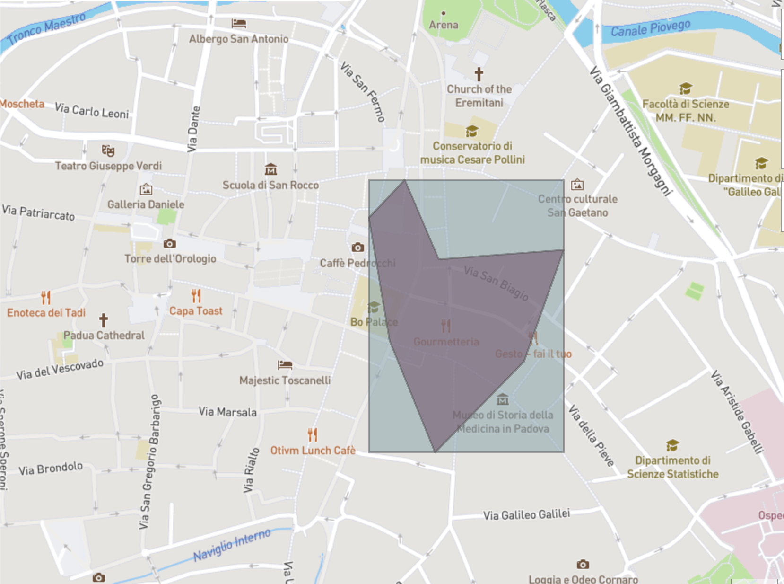

# OpenStreetMap POIs

This Python package allows to query OpenStreetMap API using OverPy and retrieve all nodes and ways included in a area. It is possible to load a list of polygons using GeoPandas (JSON, GeoJSON, Shapefile are supported) and loop through them.

The goal is to associate for every area a list of POIs retrived from OpenStreetMap.

The query will be performed on the bounding box built around the given polygon.



Two example files are provided: a [grid](https://github.com/peterampazzo/osm-poi/blob/main/example/grid.json) and a [polygon](https://github.com/peterampazzo/osm-poi/blob/main/example/polygon.geojson) over the city of Padova.
The grid has been generated using the [GeoJSON Grid Creator](https://cityofaustin.github.io/geojson-grid/) developed by the city of Austin.

## Installation

```
virtualenv env
source env/bin/activate
pip install -e ".[devel]"
```

## Quick Start

Two profile currently supported are `query` and `filter`.


| **profile**  | **command** | **description**  |
|---|---|---|
| query | `osm_poi query <path_with_filename> --label <label_name>`  | Query all the nodes and ways from OSM within the polygons included in the file passed. _args_: <ul><li>`path`</li><li>`--label` (optional)</li></ul>  |
| filter | `osm_poi filter <path_with_filename>` | Remove keys if they have been removed from the two main lists (`-nodes.json` and `-ways.json`) generated from the previous step. _args_: <ul><li>`path`</li></ul> |

To test the behaviour an example file is provided:
```
# grid.json
osm_poi query example/grid.json

# polygon
osm_poi query example/polygon.geojson
```
